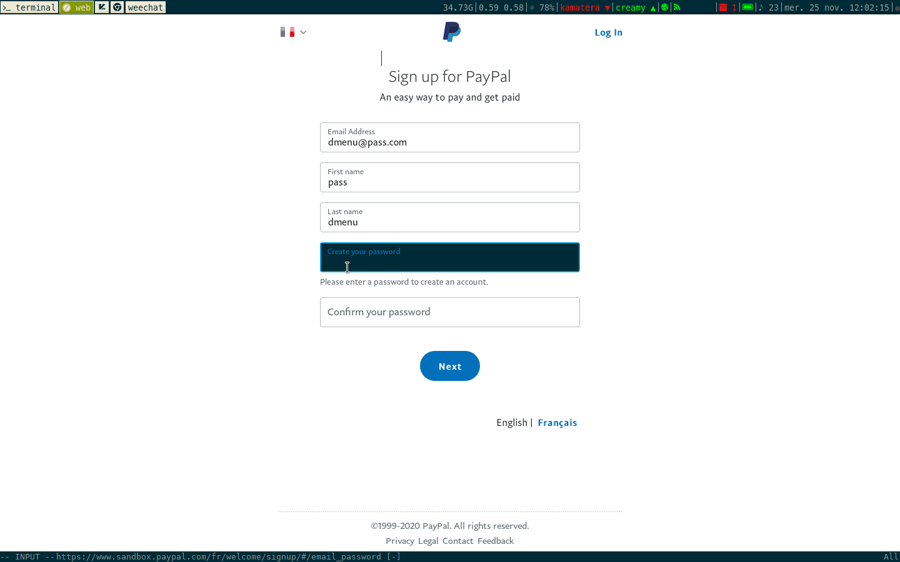

passdmenu
=========

> This a fork of [passdmenu](https://github.com/klaasb/passdmenu) by [Klaas Boesche](https://github.com/klaasb)
> with addition of ability to generate a password from the dmenu

A small python frontend to [pass](http://www.passwordstore.org) wrapping [dmenu](http://tools.suckless.org/dmenu/).

Currently only tested with Python 3.8.

Example usage as [i3](http://i3wm.org) keybindings:

    bindsym $mod+x exec passdmenu.py -G -x s -P --type -r -D ~/.local/bin/mypassdmenu
    bindsym $mod+Shift+x exec passdmenu.py -G -u -x p,s -P --type -r -D ~/.local/bin/mypassdmenu

Help:

    usage: passdmenu.py [-h] [-c] [-t] [-r] [-u [GET_USER]] [-P] [-s STORE]
                        [-d XDO_DELAY] [-f FILTER] [-B PASS_BIN] [-D DMENU_BIN]
                        [-x XSEL] [-e EXECUTE] [-g] [-G]

    A dmenu frontend to pass. All passed arguments not listed below, are passed to
    dmenu. If you need to pass arguments to dmenu which are in conflict with the
    options below, place them after --. Requires xclip in default 'copy' mode.

    optional arguments:
      -h, --help            show this help message and exit
      -c, --copy            Use xclip to copy the username and/or password into
                            the primary/specified xselection(s). This is the
                            default mode.
      -t, --type            Use xdotool to type the username and/or password into
                            the currently active window.
      -r, --return          Presses "Return" after typing. Forces --type.
      -u [GET_USER], --user [GET_USER]
                            Copy/type the username, possibly search by given
                            python regex pattern that must include a group (the
                            user part). Example pattern: '^user: (.*)' If second
                            line of gpg file is blank or the argument 'filename'
                            is given then gpg filename is used as username.
      -P, --pw              Copy/type the password. Default, use -u -P to copy
                            both username and password.
      -s STORE, --store STORE
                            The path to the pass password store. Defaults to
                            ~/.password-store
      -d XDO_DELAY, --delay XDO_DELAY
                            The delay between keystrokes. Defaults to xdotool's
                            default.
      -f FILTER, --filter FILTER
                            A regular expression to filter pass filenames.
      -B PASS_BIN, --pass PASS_BIN
                            Defaults to /usr/bin/pass
      -D DMENU_BIN, --dmenu DMENU_BIN
                            Defaults to /usr/bin/dmenu
      -x XSEL, --xsel XSEL  The X selections into which to copy the
                            username/password. Possible values are comma-separated
                            lists of prefixes of: primary, secondary, clipboard.
                            E.g. -x p,s,c. Defaults to primary.
      -e EXECUTE, --execute EXECUTE
                            The path to a command to execute. The whole content of
                            the decrypted gpg file from pass is provided to it on
                            standard input. The full password name (within the
                            store) is provided as first parameter. Arguments -s
                            and -f are forwarded as parameters.The command is
                            executed in addition to and after specified -t, -c
                            options are handled.
      -g, --generate        Generate a password if not existing. To add a user
                            enter the password name follow by a dash and by the
                            username i.e. folder/pass#username.
      -G, --generate-no-symbols
                            Generate a password same as -g except with no symbols.
